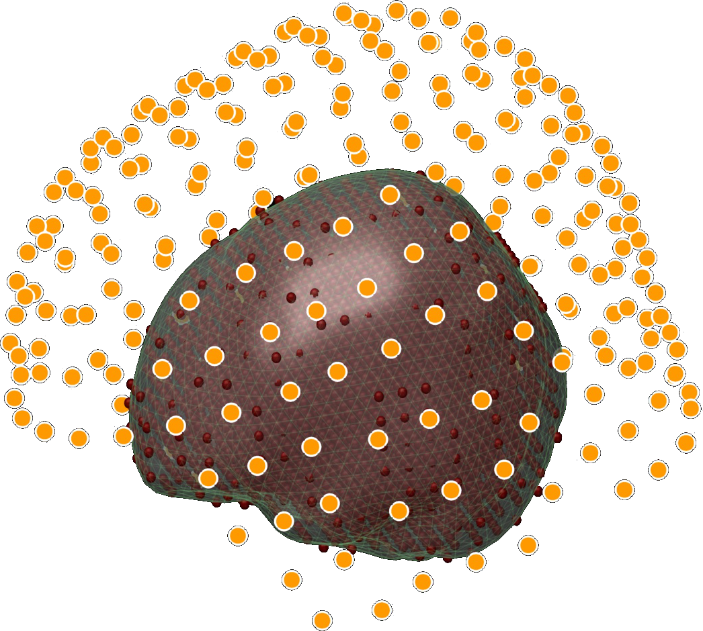

## CREx_MEG_FieldTrip 

 Matlab toolbox using <a href="https://github.com/fieldtrip" target="_blank">FieldTrip functions</a> to process MEG data. 
See Fieldtrip documentation : <a href="http://www.fieldtriptoolbox.org/" target="_blank">www.fieldtriptoolbox.org</a>.

The general purpose of theses scripts is to automatized data processing of MEG data sets and to help interpret the results by editing appropriate representation of the outputs. 
Figures of results are automatically saved in specific directories created in the data directory. New data are saved whith matrices names link to the specific processings.

* **batches directory** : scripts to launch data processing on an entire set of data

* **ft_CREx** : toolbox containing all the functions that interface those of FieldTrip toolbox

<a href="http://www.fieldtriptoolbox.org/"></img></a>  FieldTrip toolbox is required to be set in Matlab paths. FieldTrip can be download here : https://github.com/fieldtrip
FieldTrip tutorials : http://www.fieldtriptoolbox.org/

<a href="http://meg.univ-amu.fr/wiki/Main_Page"></img></a>  The processing was done with the help of the Marseille MEG center (France).

-------
Developed by the <a href="http://blricrex.hypotheses.org/" target="_blank">CREx</a> (Centre of Experimental Resources of the <a href="http://www.blri.fr/" target="_blank">Brain and Language Research Institute</a>)
