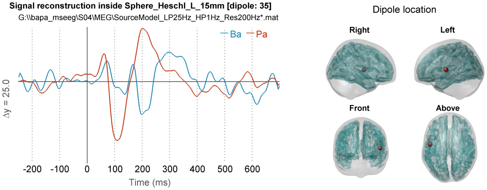

##  Matlab  toolbox using <a href="https://github.com/fieldtrip" target="_blank">FieldTrip functions</a> to process MEG data sets  

See FieldTrip documentation : <a href="http://www.fieldtriptoolbox.org/" target="_blank">www.fieldtriptoolbox.org</a>.

The general purpose of these scripts is to automatize the data processing of large MEG data sets and to help with the preprocessing and analysis. 
Figures of results are automatically saved in specific directories inside the data directory. Output data are saved with a specific name, depending on the processing and associated parameters. 

A method to define the head model from a template (without the subject's MRI) has been included and adapted from Yuval Harpaz, 2013 (original codes here :  https://github.com/yuval-harpaz/ft_BIU ).

<a href="http://meg.univ-amu.fr/wiki/Main_Page" target="_blank"></img></a>  The processing was done with the help of the <a href="http://meg.univ-amu.fr/wiki/Main_Page">Marseille MEG center</a> (France).

<a href="http://www.fieldtriptoolbox.org/" target="_blank"></img></a>  FieldTrip toolbox is required to be set in Matlab paths. FieldTrip can be download here : https://github.com/fieldtrip
FieldTrip tutorials : <a href="http://www.fieldtriptoolbox.org/" target="_blank">http://www.fieldtriptoolbox.org/</a>

### Directories content
* **batches directory** : scripts to launch data processing on an entire set of data

* **ft_CREx** : toolbox containing all the functions that interface those of FieldTrip toolbox

 

##

 

 
 Example of figure showing reconstructed signals for 2 conditions at a specific dipole location (figures are generated for every dipole inside the Regions of Interest that are specified as input parameter).

## "Wiki coming soon !!"

-------
Developed by the <a href="http://blricrex.hypotheses.org/" target="_blank">CREx</a> (Center of Experimental Resources of the <a href="http://www.blri.fr/" target="_blank">Brain and Language Research Institute</a>)
